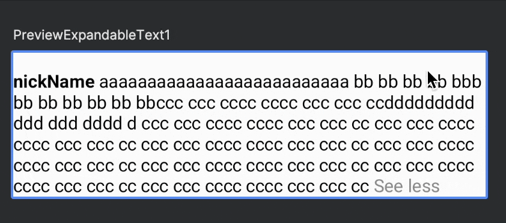

# How to use

```
dependencies {
	implementation 'com.github.sarang628:ExpandableText:Tag'
}
```

```
ExpandableText(
    modifier = Modifier.align(alignment = Alignment.BottomCenter),
    nickName = "nickName",
    text = "aaaaaaaaaaaaaaaaaaaaaaaaaa " +
            "bb bb bb bb bbb bb bb bb bb bb bb" +
            "ccc ccc cccc cccc ccc ccc cc" +
            "ddddddddd ddd ddd dddd d ccc ccc cccc cccc ccc ccc cc ccc ccc cccc cccc ccc ccc cc ccc ccc cccc cccc ccc ccc cc ccc ccc cccc cccc ccc ccc cc ccc ccc cccc cccc ccc ccc cc ccc ccc cccc cccc ccc ccc cc ccc ccc cccc cccc ccc ccc cc",
    onClickNickName = {}
)
```